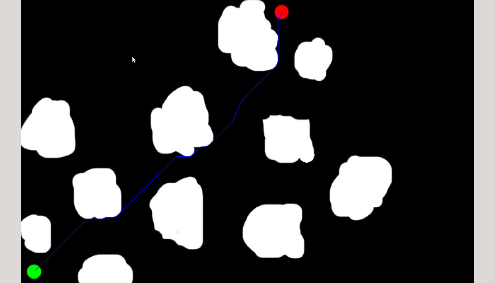

# AGV-Task1

This is the repository for all the codes related to AGV Task - 1 (Path Finder)

## Installing open cv

Type in the following commands one by one to install the opencv library

`sudo apt-get install build-essential cmake git libgtk2.0-dev pkg-config libavcodec-dev libavformat-dev libswscale-dev`

`sudo apt-get install python3.5-dev python3-numpy libtbb2 libtbb-dev`

`sudo apt-get install libjpeg-dev libpng-dev libtiff5-dev libjasper-dev libdc1394-22-dev libeigen3-dev libtheora-dev libvorbis-dev libxvidcore-dev libx264-dev sphinx-common libtbb-dev yasm libfaac-dev libopencore-amrnb-dev libopencore-amrwb-dev libopenexr-dev libgstreamer-plugins-base1.0-dev libavutil-dev libavfilter-dev libavresample-dev`

`sudo -s`

`cd /opt`

`git clone https://github.com/Itseez/opencv.git`

`git clone https://github.com/Itseez/opencv_contrib.git`

`cd opencv`

`mkdir release`

`cd release`

`cmake -D BUILD_TIFF=ON -D WITH_CUDA=OFF -D ENABLE_AVX=OFF -D WITH_OPENGL=OFF -D WITH_OPENCL=OFF -D WITH_IPP=OFF -D WITH_TBB=ON -D BUILD_TBB=ON -D WITH_EIGEN=OFF -D WITH_V4L=OFF -D WITH_VTK=OFF -D BUILD_TESTS=OFF -D BUILD_PERF_TESTS=OFF -D CMAKE_BUILD_TYPE=RELEASE -D CMAKE_INSTALL_PREFIX=/usr/local -D OPENCV_EXTRA_MODULES_PATH=/opt/opencv_contrib/modules /opt/opencv/`

`make -j4`

`make install`

`ldconfig`

`exit`

You now have opencv library.

## Subtask-1

In this subtask we are required to find the shortest path between the starting\
point and the ending point with obstacles in between them, considering the bot has\
a point object

The image is given to us. I detected the starting point and the ending point and\
found the path as close to the shortest path as possible using A* algorithm. Here, I\
considered the diagonal movement to cost 1.414 times that of a straight movement.

The path is printed as well as shown in the image along with the path length.

I created a structure "tryst" to store the details of each pixel

Then I created a matrix of tryst storing the details of each pixel and implemented the algorithm\
with set data type of tryst ordered by the f-cost as open list. The closed list is\
incorporated in the matrix.

The output of the sample image will look like this

To use this program\
Clone the repo
`git clone https://www.github.com/thelethalcode/AGV-Task1.git`\
Cd into the directory
`cd AGV-Task1`\
Make the file
`make Subtask1`\
Execute the file with the image name as the argument
`.\Subtask1 a.png`

You need to have opencv2 to be able to execute the file.

## Subtask-2

In this subtask also, we are required to find the shortest path, but this time we\
have to take into account the dimensions of the bot.

So initially while initialising the walls, I initialised the pixels in the Minkowski\
sum of the bot and the obstacles as not traversable.

The rest of the algorithm is the same as the first subtask. Also, along with the path\
being printed and shown, this time, the movement of the bot along the path is also shown.\
A space of 2 pixels is left as a buffer space between the obstacles and the bot.

To use this program\
Clone the repo
`git clone https://www.github.com/thelethalcode/AGV-Task1.git`\
Cd into the directory
`cd AGV-Task1`\
Make the file
`make Subtask2`\
Execute the file with the image name as the argument
`.\Subtask2 a.png`

The link for the output of the program is

And don't forget the opencv library

## Subtask-3

In this subtask we have to take into account the orientation of the bot too. The algorithm\
is same as the previous subtask, but the previous path had too many unnecessary turns in it\
which is not a suitable way of travelling in real life.

So, after finding the path, a path smoothing algorithm has been applied to make the number\
of turns minimal without changing the actual path.

The program, along with printing and showing the path in the image, shows the movement of\
the bot considering its orientation too.

To use this program\
Clone the repo
`git clone https://www.github.com/thelethalcode/AGV-Task1.git`\
Cd into the directory
`cd AGV-Task1`\
Make the file
`make Subtask3`\
Execute the file with the image name as the argument
`.\Subtask3 a.png`

The link for the output of the program is
